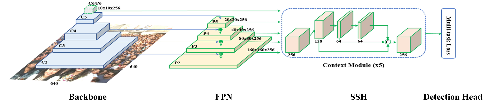
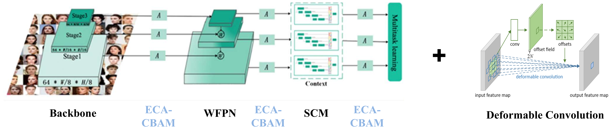
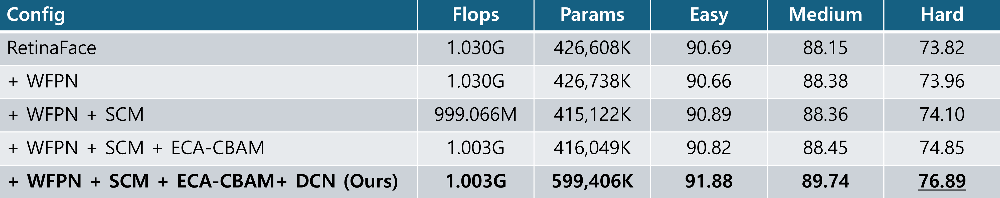
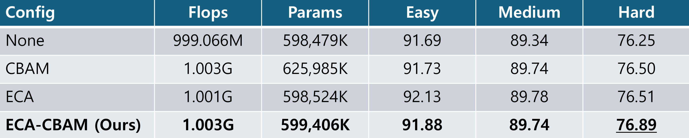
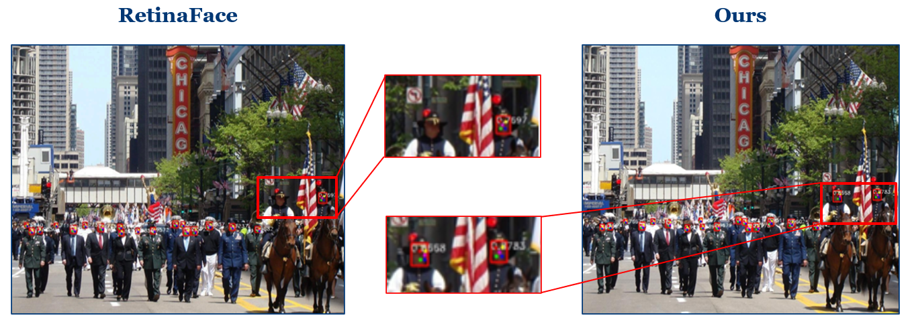

# Abstract

This project optimizes the [RetinaFace](https://github.com/biubug6/Pytorch_Retinaface) model for lightweight deployment and enhanced detection performance. By refactoring and decoupling core modules with a MobileNet 0.25 backbone, our proposed model **reduces FLOPs by ~2.6%** while **improving AP by 3.07%** on the WiderFace Hard validation set compared to the baseline.

### Customized Modules
* **ECA-CBAM:** Integrates ECA into the CBAM structure by replacing the MLP in the Channel Attention module with a 1D Conv. It improves AP by **~0.38%** on WiderFace Hard with only a marginal **~0.16% increase in FLOPs** compared to standard ECA.
* **WFPN (Weighted Feature Pyramid Network):** Replaces simple summation in FPN with learnable weighted combinations to prevent information loss. Integrated with Deformable Convolution Networks (DCN) to better detect distorted objects.
* **SCM (Shuffle Context Module):** Reduces channels to suppress computational cost and uses channel shuffling to efficiently enhance feature representations. Also integrated with DCN.
* **Deformable Convolution:** Captures features robustly using offsets, significantly compensating for detection performance on small and deformed faces.

--- 

# RetinaFace vs Our Model

## RetinaFace Structure
* Backbone ➞ FPN ➞ Detection Head



## Our Model Structure
* Backbone ➞ ECA-CBAM ➞ WFPN ➞ ECA-CBAM ➞ SCM ➞ ECA-CBAM ➞ SCM ➞ ECA-CBAM ➞ Detection Head



---

# Results

## Ablation Study



* **FLOPs reduced by 2.6%** compared to the baseline RetinaFace (based on 640 x 640 image input).
* **AP improved by 1.19% (Easy), 1.59% (Medium), and 3.07% (Hard)** on the WiderFace dataset.

## Attention Ablation Study



* ECA-CBAM outperforms ECA and CBAM by **0.38% and 0.39% AP**, respectively, on WiderFace Hard.
* While ECA is sufficient for relatively easy cases, the spatial attention in ECA-CBAM proves highly effective for detecting small or occluded faces.
* Achieves performance gains while maintaining FLOPs and parameter counts nearly identical to ECA.

## Visualization



---

# Installation
## Clone and install
1. git clone https://github.com/kyeongha-git/Face_Detection_Project

2. Pytorch version 1.1.0+ and torchvision 0.3.0+ are needed.

3. Codes are based on Python 3

##### Data
1. Download Link: from [google cloud](https://drive.google.com/open?id=11UGV3nbVv1x9IC--_tK3Uxf7hA6rlbsS) Password: ruck

2. Organise the dataset directory as follows:

```Shell
  ./data/widerface/
    train/
      images/
      label.txt
    val/
      images/
      wider_val.txt
```
ps: wider_val.txt only include val file names but not label information.

## Training
We provide restnet50 and mobilenet0.25 as backbone network to train model.
We trained Mobilenet0.25 on imagenet dataset and get 46.58%  in top 1. If you do not wish to train the model, we also provide trained model. Pretrain model  and trained model are put in [google cloud](https://drive.google.com/drive/folders/12iCRdAreBJeNPZSqD0C-dXfNZ5R4m6RD?usp=sharing). The model could be put as follows:
```Shell
  ./weights/
      mobilenet0.25_Final.pth
      mobilenetV1X0.25_pretrain.tar
```
1. Before training, you can check network configuration (e.g. batch_size, min_sizes and steps etc..) in ``src/utils/config.py``.

2. Train the model using WIDER FACE:
  ```Shell
  CUDA_VISIBLE_DEVICES=0,1,2,3 python tools/train.py --network mobile0.25
  # or
  CUDA_VISIBLE_DEVICES=0 python tools/train.py --network mobile0.25
  ```


## Evaluation
### Evaluation widerface val
1. Generate txt file
```Shell
python tools/test_widerface.py --trained_model weight_file --network mobile0.25
```
2. Evaluate txt results. Demo come from [Here](https://github.com/wondervictor/WiderFace-Evaluation)
```Shell
cd ./widerface_evaluate
python setup.py build_ext --inplace
python evaluation.py
```
3. You can also use widerface official Matlab evaluate demo in [Here](http://mmlab.ie.cuhk.edu.hk/projects/WIDERFace/WiderFace_Results.html)
### Evaluation FDDB

1. Download the images [FDDB](https://drive.google.com/open?id=17t4WULUDgZgiSy5kpCax4aooyPaz3GQH) to:
```Shell
./data/FDDB/images/
```

2. Evaluate the trained model using:
```Shell
python tools/test_fddb.py --trained_model weight_file --network mobile0.25
```


# Reference

* RetinaFace Paper: [https://arxiv.org/abs/1905.00641](https://arxiv.org/abs/1905.00641)
* RetinaFace Code: [https://github.com/biubug6/Pytorch\_Retinaface](https://github.com/biubug6/Pytorch_Retinaface)
* FDLite Paper: [https://arxiv.org/abs/2406.19107](https://arxiv.org/abs/2406.19107)
* Light-Weight RetinaNet for Object Detection Paper: [https://arxiv.org/abs/1905.10011](https://arxiv.org/abs/1905.10011)
* ACWFace Paper: [https://www.spiedigitallibrary.org/journals/journal-of-electronic-imaging/volume-31/issue-1/013012/ACWFace-efficient-and-lightweight-face-detector-based-on-RetinaFace/10.1117/1.JEI.31.1.013012.short](https://www.spiedigitallibrary.org/journals/journal-of-electronic-imaging/volume-31/issue-1/013012/ACWFace-efficient-and-lightweight-face-detector-based-on-RetinaFace/10.1117/1.JEI.31.1.013012.short)
